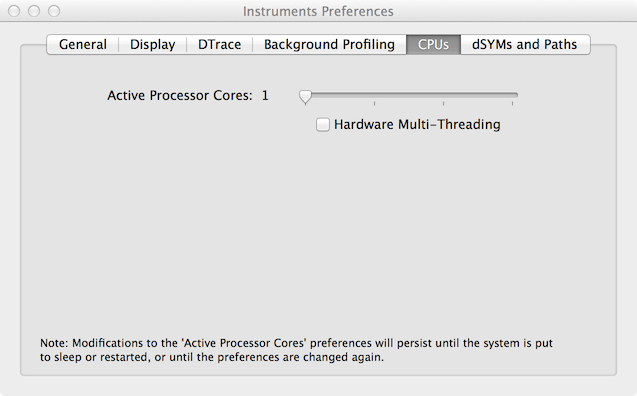

# 覚書

## 実験環境

```
2.7 GHz Intel Core i7
16 GB 1600 MHz DDR3
NVIDIA GeForce GT 650M 1024 MB
OS X 10.9.5（13F1066）
```

## Lua VM

ただひとつのLua VMが、ただひとつのスレッドからなるプロセスで実行される。

## Mac OS X

Xcode 6.2では、Instruments Preferencesで有効なコア数を調整できる。有効なコア数をひとつにすることで、マルチコアによる影響をなくすことができる。



また、システム環境設定の省エネルギーでパフォーマンスに影響を与えそうな項目を調整する。

他のタスクがなるべく動いていない状態で計測することが望ましいが、停止できないタスクも存在する。CPUのキャッシュやタスク優先度を調整しても、これらの影響を除外することは難しい。

